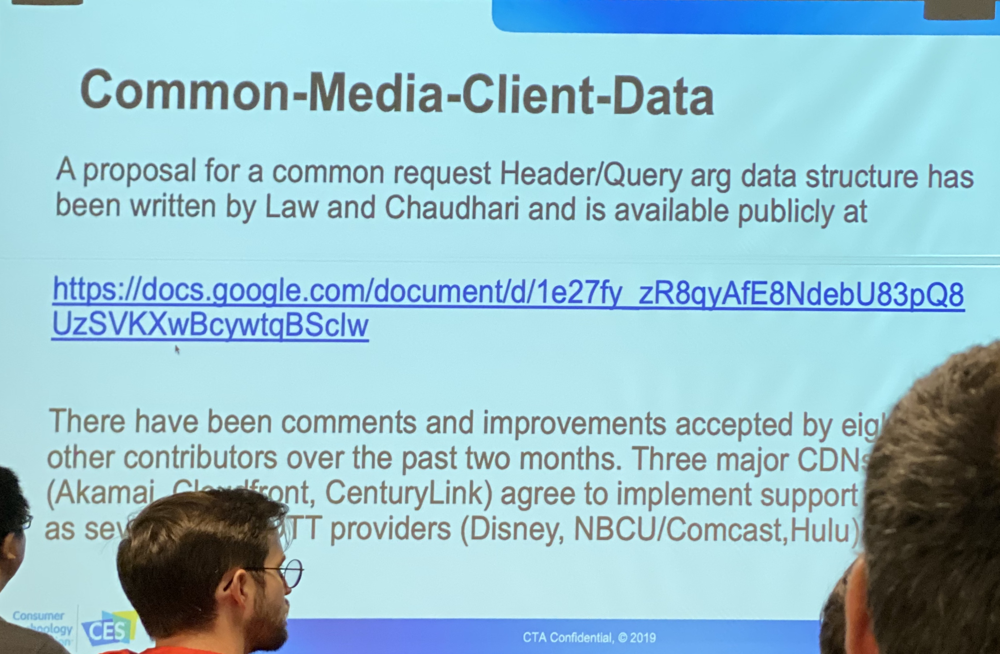
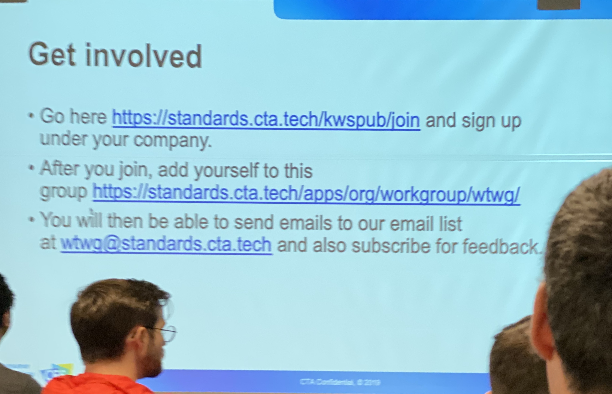
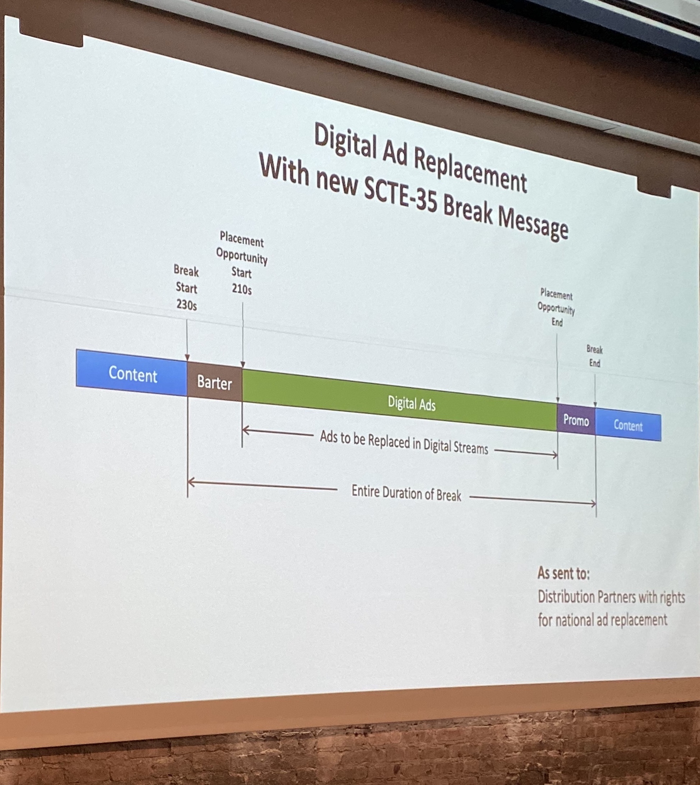
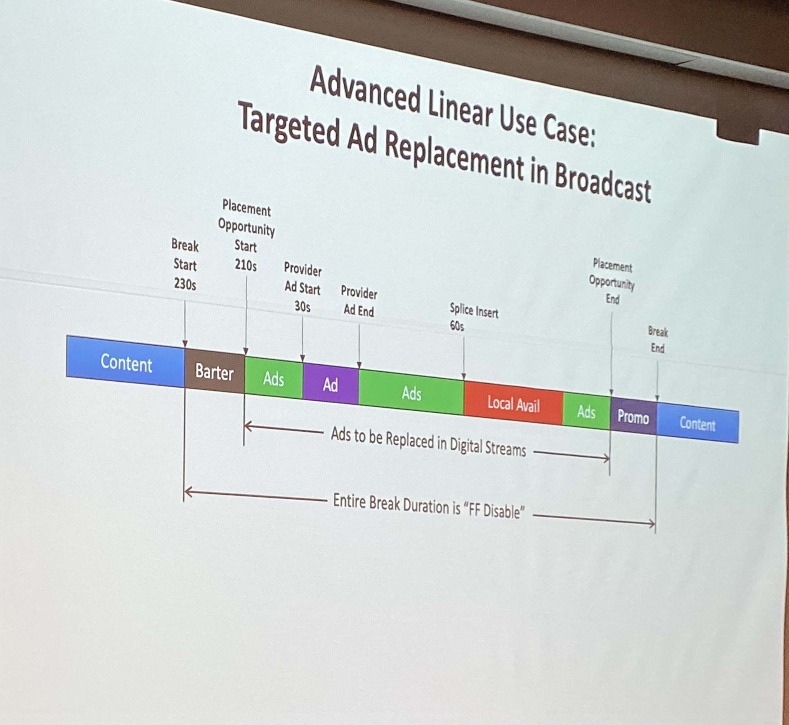

# FOMS [SF] October 2019
See schedule for more session notes http://www.foms-workshop.org/foms2019SF/pmwiki.php/Site/Schedule

## Monday 11/21

### Position Statement
Rob Walch - JW Player, Web Player Principal

- Low-Latency
    - MSE v2 (codec transition)
    - Bandwidth Estimation (+ABR)
    - fetch in worker (which browser)
    - LL Workflow
        - fetch/xhr issue: H/2 byteranges never cached
- Player Benchmarking
    - Performance Resource Timing (resoures, first paint, long task observers)
    - Video playback quality
- WebVTT / IMSC1
- * MetaData (SCTE, DATERANGE, Cross-Browser)
    - Frame accurate
- Error Handling
    - Specific segment (or url)

### Lightning Talk: Will Law Common-Media-Client-Data

- CTE spec for Player to tell CDN what it needs and how it's doing

    *Coming soon: Common-Media-Server-Data

### MSE v2

Wolz:
- Main features (not yet available)
    - MSE available in worker context
        - ObjectUrl context creation in the Worker (pass it to main thread)
        - need buffered and currentTime from BufferSource and MediaElement in main thread
    - Chrome Origin trial this/next quarter
    - Firefox / Safari to follow
- API for standardizing interop around gaps
    - https://github.com/w3c/media-source/issues/160
    - allow gaps? on which tracks?
        - minimum jump
        - play-through
    - pops with audio gaps
    - Tell SourceBuffer how to deal with gaps (configure buffer)

v-Next:
- Appending small amounts of data (frames)
    - Chrome does 128k at a time
    - Scheduling overhead
    - Does byte-stream format have to be one mp4
    - GOP based? Frame based
    - Min playback buffer to player "canplay"?
        - ~3 frames, 200ms audio in Chrome
        - 2-3 seconds
        - ~30 frame latency in Edge
- Chrome latency hint
    - Byte stream can say it's live to just play
- Minimum playback buffer
    - See Exo play when ready (load control determines "ready" or "canplay" / have future data or autoplay has enough)
    - Shaka sets playbackRate to 0 to wait for more data
- Auto EMSG data extraction
    - using box parser sucks
    - Add a SourceBuffer event please, sidx time offset
    - Safari does it for ID3 emsg data
- Other topics we didn't get to
    - Infinate GOP GC
    - Multi SourceBuffer
    - new SourceBuffer no tag
    
### Talk: Eric @ Apple

- `TextTrackCue` constructor that takes document fragment (VTT markup?)
    - fragment can have inline styles
- Native rendering honors Apple accessibility subtitle styling preferences

### Talk: MediaCapabilities updates

- HLS decode and display support
- Spacial Audio support

### Low-Latency

- WebTransport
    - Reliable vs Unreliable data channel (ex: http vs udp)
    - Quic / WebSocket / UDP / WebRTC 
    - Application can fallback to HTTP2 or Quic fallback on it's own
    - WebRTC is overkill for Client-Server data transfer (more for P2P)
    - Unreliable Quic provides congestion control not available with UDP alone
    
- Common Workflow
    - How to simultaneously publish
        - Dash-LL (CTE)
        - LHLS (CTE)
        - LL-HLS from Apple
            - Will: double egress, less cache efficiency
            - CDNs don't do range-requests for partial files
            - Browser cache doesn't support H/2 push range-requests
                - Link header is being reused which breaks other uses
                - Will: make a new header explicitly for this
            - Steve: Who will implement this spec?
            
- Bandwidth Estimation
    - ACTE doesn't work (for Twitch in browsers outside of Chrome)
    - Side load to get estimation
        - more packets in addition to current or another rendition?
    - A new API for getting bandwidth (server-client) from the browser
        - Will: extension to fetch API? kbps
        - NetworkInfo?
        - Performance Resource Timing?
    - BYO Readable Stream in fetch or set highwatermark
    - Measure bursts
        - but what about web developers who use dev tools to throttle and complain about player behavior
        - small chunks may always be offloaded and come bursts that look like higher throughput than what is available
        - H/2 cache ruins estimation
    - Hit up WHATWG for fetch extensions
        
- PlaybackRate adjustment
    - Pitch correction is not uniform

- WebRTC
    - Will: When will AV1 real-time be supported (Using "David" decoder)

### Shaka Streamer

- Simply setup packaging for streaming without all the complexity involved in using FFMPEG
- widevine
- (Google) cloud push

### Media-Internals

It's coming to Dev-Tools!

### Error Handling

- Video decode errors (code 3)

- Microsoft extended error codes on media-errors
    - Two pages of DRM errors
- Chrome EME DRM errors

- Eric: Don't worry about what's possible or what the underlying errors are
    - Identify the type of information that would be useful and make a proposal
    
Additional Notes: https://docs.google.com/document/d/1BaxJtVFGFv9sLMT5UkM7g3KYo0OTOh54ptWQJ82qKNM/edit#heading=h.74gq3url0e1s
(these are also available in FOMS http://www.foms-workshop.org/foms2019SF/pmwiki.php/Site/Schedule)

### Cross-platform, interop

Interop issues

- HLS Manifest metadata: DATERANGE tags not exposed in Safari as "metadata" TextTrack cues
    - There's a patch coming to Safari Preview soon
    - Need to verify SCTE data in DATERANGE tags with matching ids does not cause MediaElement error
    - Need to verify cue time ranges when stream is missing PDT (even though streams with DATERANGE should require PROGRAM-DATE-TIME)
- MSE Buffer eviction is problematic on TVs
    - See new eviction policy proposal (in MSE v2)
- `setLiveSeekableRange` needed when using native controls. Appending on certain platforms with duration `Infinity` can fail
    - Which environments? Is there a bug filed for this?
- Libraries for testing support on TVs:
    - https://www.cobalt.dev/
    - https://github.com/cta-wave/WMAS
- EME crypto scheme detection
    - Coming soon
- `fetch` in workers is supported
    - Chrome yes
    - Firefox yes
    - Safari no
    - TVs no
    - Since client will need to support fetch inside and outside of the workers, should there be an example feature test for this?
    - What about libraries that accept network filters or loaders as input on the main thread?
- Only naive fullscreen on iOS
    - Prevent players from offering an auto-rotate to fullscreen in portrait orientation (as in Youtube app and active viewable players in Android Chrome)
- 360 video such a small use case but copying video context is still a huge challenge (WebGL, CORS)

## Tuesday 11/22

### Community

- How to improve attendence at local video-dev meetups
- How to improve FOMS
- How to make attendance more diverse

### SCTE-35 Ad Breaks in Broadcast

- Ad break start: barter, opportunity start: ads

### MediaCapabilities v2

- Hardware decoder or not?
    - `powerEfficient` bool indicates a hardware encoder or software decoding at small resolutions
    - `powerEfficient` will return `true` when there is a lack of data
- Multiple decoders?
    - No. Would be a hack and not reliable or useful in the context of a single page.
- EME discoverability?
    - Shaka doesn't yet use MediaCapabilities
    - It does have to pass video and audio capabilities "robustness" to EME to get a MediaKey ("robustness" used by Widevine will be deprecated)
- RemotePlayback API is a pain for AirPlay
    - How do you pick the right stream (url)? Requires out-of-band knowledge
    - When an Apple device specified a remote AirPlay device, that device handles playback of urls
        - `canPlay` may be wrong on the sender
        - If using WebAudio API then bytes are sent across
        - With MSE it's more complicated
    - Sender MediaElement would not dispatch an "error" event
    - Could maybe use the MediaElement Source element list
        - How does one specify a source element for use with MSE (blob)?
    - You can't change a url mid-stream, but could reload alternate SSAI'd stream urls
- CPU Info
    - CPU and GPU info is not necessarily helpful and not available for privacy reasons

# DEMUXED

## Wednesday 11/23

### NICK CHADWICK @MUX
Super Resolution: The scaler of tomorrow, here today!

### RYAN B HARVEY
Modeling the conceptual structure of FFmpeg in JavaScript

### SARAH ALLEN
RTMP: web video innovation or Web 1.0 hack… how did we get to now?
Sarah worked at Macromedia and Adobe on Director and Flash

### ZACHARY CAVA
Scalable Per-User Ad Insertion in Live OTT
- DASH manifests allow for "wrapped" ad manifest patches

### CHARLES SONIGO & JEAN-BAPTISTE LOUAZEL @ STREAMROOT
Building an automated testing suite: How to gain confidence that your release will not break playback for any platform/player/OS/format combination (joint talk)
https://github.com/streamroot/dna-integration-samples

## Thursday 11/24

### Marina Kalkanis, M2A Media: Apple Low-Latency HLS
Serving LL-HLS For DAZN Live Sporting Events

- Features:
    - Partial Segments
    - Playlist Blocking (until refreshed with msn/part query request)
    - Http/2 (Push part or segment with playlist msn/part query request)
    - Delta Playlist (SKIP request)
    - Rendition Report
- Latency comparison
    - Typical latency: ~6s segmenta x ~5 trips:
        - encoder, origin, cache , CDN, client buffer
    - LL latency: .23 x 5 = 1.6s
- You may have multiple parts for a single GOP
    - 8 parts with only 2 that are "INDEPENDENT=YES" (GOP key frames)
    - 1.9s GOP to align with audio sample rate (48hz?)
- Verify blocking, push, delta working properly
    - Use session ids to help with login
- Challenges
    - HTTP/2 support (works great, but not supported everywhere)
    - Players (Apple still changing spec)
    - DVR

### BEN DODSON: Analyzing Video Metrics like Richard Feynman
Book: "What DO you care what other people think?"

- Don't fool yourself
- Even with high quantitative abilities, your biases limit your ability
- Look at the Anscombe's quartet different data with same sample variance, mean, etc...
    https://en.wikipedia.org/wiki/Anscombe%27s_quartet
- Which percentage of users experience a p90 stall duration?
- Have curiosity and a bit of luck (Ask if it's a valve.)

### TE-YUAN HUANG
QoE Impact from Router Buffer sizing and Active Queue Management

### STEVE ROBERTSON
This talk is not really about JavaScript

- dropped frames are not really caused by network conditions. dropped frames happen when:
    - switching tabs
    - audio and video tracks are not perfectly aligned
    - other page/browser/os performance issues
- don't change from the ideal path just because of dropped frames
   
### ASHUTOSH AGRAWAL
Doing Server-Side Ad Insertion on Live Sports for 25.3M Concurrent Users 

## Notes 

- When do browsers start playback? Measure buffering length(s) at canplay across UAs
- Eric @ Apple has a patch for inband manifest DateRange metadata
- ArrayBufferBuffer spec
    (Iterable of ArrayBuffers that acts as a single ArrayBuffer to avoid concats/alloc)
- TODO: elbar@peer5.com Peer5: Access to (or interface for both) HLS.js Loader and pLoader, registerNetwork
   - shaka.net.NetworkingEngine.registerScheme(schemeId, requestCallback)
   - Using the loader allows them to provide bandwidth estimate
   - Provide a stable path even if undocumented for accessing hls.js and shaka
   - Must be global context so it applies to all players
- smart-TV resources
    - https://developer.samsung.com/tv/develop/specifications/web-engine-specifications
    - https://developer.samsung.com/tv/develop/specifications/media-specifications
    - https://developer.samsung.com/tv/develop/specifications/tv-model-groups